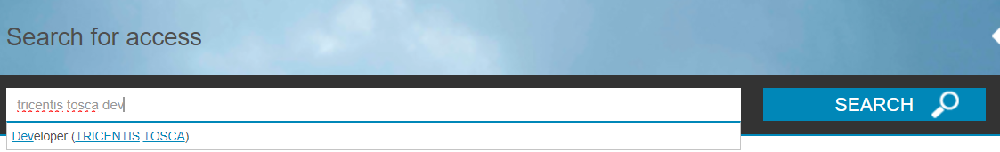
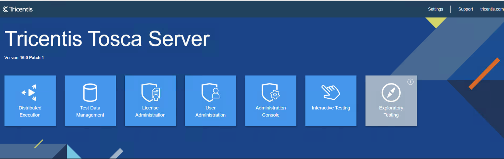

# Getting-started

Here you will find what you need to get stared with test automation.

## About Tricentis Tosca

Tricentis Tosca is a set of tools for test automation, with a no-code, AI-powered approach. It features amongst others:

- **Vision AI**: “sees” like a human does, enabling it to easily automate testing for applications that were previously difficult or impossible to automate;
- **Model-based test automation**: separates the technical information of an application with the automation model. Boosts automation rates, reduces maintenance costs, and maximizes efficiency;
- **Risk-based test optimization**: helps you prioritize testing for business-critical functionality, reduce overall test creation and maintenance costs, and make smarter “go/no-go” release decisions;
- **Service virtualization**: test responses from systems that are difficult to access/provision or that have not been built yet. This removes one of the major sources of testing delays, enabling automated tests to run at any time;
- **Test data management**: automatically create and provision on-demand (synthetic, masked, or imported) stateful data for even the most complex scenarios;
- **Distributed execution**: running multiple tests in parallel across distributed infrastructures and virtual machines in order to test faster and at scale;
- **API scan**: simplifies API testing;
- **Automation recording assistant**: record their day-to-day activities that can then be converted into automated test cases;
- **Dashboards**: web-based reporting solution;

The tools being used in NextGen ERP include:
- **Tosca Commander**: creation of modules for module-based testing, test cases, executions/runs, scanning, test data;
- **DEX agents**: distributed execution of tests;
- **Tosca Server**: Manage access levels, authorization, send updates regarding availability of DEX agents;  

## Access to and Installation of Tosca Commander

Automation Test developers will use Tosca Commander in order to write and run tests. It must be installed either in a VDI or an Equinor computer. 

The installation is done through Equinor Applications (Equinor's version of Software Center). To install Tosca Commander:
- Before installing Tosca Commander the user must make a request for it on AccessIT. In AccessIT, request for "Developer (TRICENTIS TOSCA)";
  - 
- The user must be added to the developers group in Tosca Server, in the User Administration. Please contact [André Brunelli](mailto:acbr@equinor.com) or [Mahesh Gore](mailto:mgore@equinor.com) for that.
- Apart of AccessIT your user must be added on Tricentis Admin Space. Please contact [Mattis Furuset](mailto:meine@equinor.com) for that.
- once access is granted open Equinor Applications and install "Tricentis Tosca";

## Opening Project in Commander

To create a workspace for an MS SQL Server, follow the steps below: 

- On the Tosca Commander start screen, click Create new. 
- In the subsequent Tosca Commander: Create new workspace window, select MS SQL Server,  from the Select type of Repository drop-down menu. 

- Choose whether to use an existing repository or a new repository for your workspace:- 
  - To create a new workspace in an existing repository, enable the check box Use existing Repository. 
- Connect to the database in the following ways: 
  - If you use MS SQL and log in to the database with your LDAP user, enter the connection string in the format Server=EAWEDWAPTSC01.sapdomain.equinor.com;Database=OperationalStore;Uid=ToscaUser1;Pwd=NxtDigitalC0re@769; 
  - Enter a valid connection string that contains the parameters described in the table below: 
- After a standard installation, Tricentis Tosca creates new workspaces in the default directory C:\Tosca_Projects\Tosca_Workspaces. You can specify a different directory in the Create new workspace in field. 
- Enter a unique name for your workspace into the Select name for new workspace field. 
- Click OK. 
- You will see a pop up window for Login, displaying ‘Username’ and ‘Password’ fields. 

- Click on ‘Login’ button 
- User will be navigated to the newly created workspace 
 

## Access to Tosca Server Administration Console (for Admins only)

Tosca Server contains a series of services to enable management of authentication, test data, DEX servers, licenses amongst others, as well as an Administration Console.

Access to Tosca Server Administration Console is granted only through Virtual Desktop running in Equinor. Users may access through https://saptsc01.statoil.no/#/. 

For more information regarding the setup of Tosca Server, please refer to [Runbook Tricentis Tosca Server](https://statoilsrm.sharepoint.com/:w:/r/sites/IntegratedNextGenERPTeam/_layouts/15/Doc.aspx?sourcedoc=%7B562D65D4-A92F-4F55-938E-DC96D59B1CD7%7D&file=Runbook%20Tricentis%20ToscaServer_Latest.docx&action=default&mobileredirect=true).