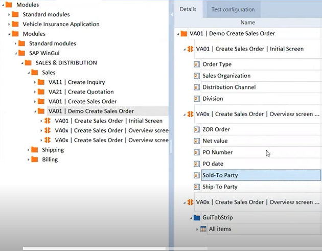
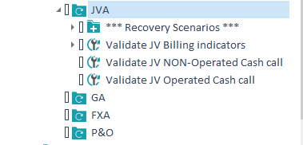
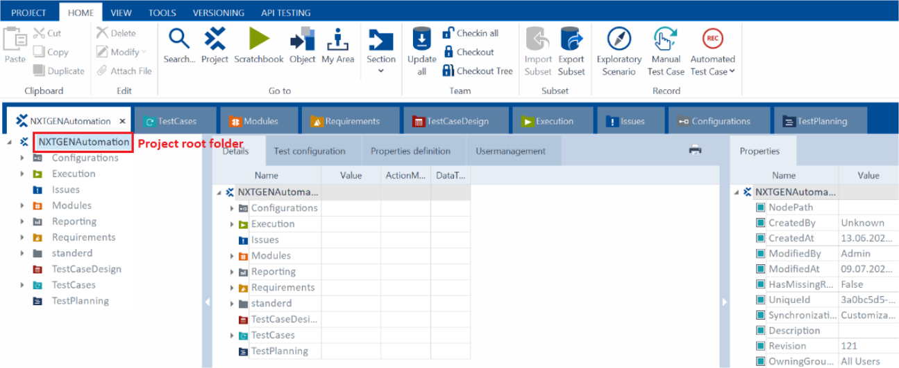
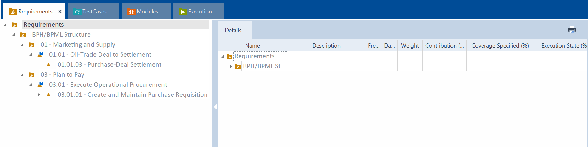
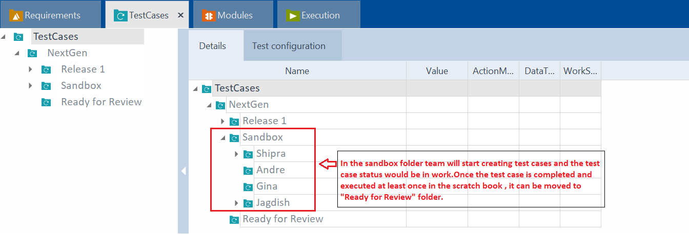
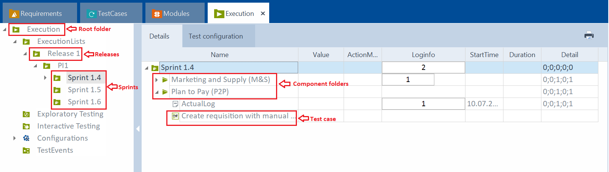

# Tosca Guidelines

This page contains instructions on how to create robust automation scripts, execute them effectively, and analyze the results. You'll also learn how to maintain and update your automation assets to keep pace with the evolving software landscape.

 **[Best practices for test automation](./tosca-best-practices.md).**

## Naming Conventions

### Modules

The following convention is recommended by Tricentis:

- Folder name
    - named according to transaction(s) + business description
    - E.g.: ME21N | Purchase Order
- Subfolder name
    - named according to containing parts
- Module subname
    - Modules should be logically named for the screen each represents, or the control group on a screen if the control group appears in more than one (1) screen instance.  Where practical, modules will be grouped in folders for ease of reference. This is critical as the volume of test assets, especially modules grow, and as the team of Tosca test engineers expands.
    - E.g.: Everything within the TAB "Org. Data"
- ModuleAttribute name
    - business name of the control to be steered

--

### Test Scenarios

Test scenarios encapsulate a functional workflow with a known outcome that is validated. A test scenario name should be a summary of its intention, i.e., summary of the actions performed by its components to steer the AUT to desired outcome.

## Folder structure of Project workspace in Tosca 

### Project Structure

### Requirement Structure

The requirement structure should be replicated from the qtest BPML hierarchy.

### Module Structure

Standard Modules for SAP GUI and Fiori applications.

Standard Modules under Sap folder can be used for automation of SAP GUI application. Eg: SAP Menu, SAP Logon etc.

In Tosca commander 16.0 onwards standard modules also have fiori modules which can be used for fiori application automation. Eg: SAP Tile and SAP WaitForBusyIndicator.

### Test Case Structure

### Execution List Structure

