# Tricentis Tosca Commander Best Practices

This guideline will be gradually built as we advance on the use of tools. For suggestions and improvements please contact acbr@equinor.com.

## Creation of Modules

### Create modules for sections of pages

A Module is created for each functional unit of the object to be tested. These functional units can be, for instance, whole websites in a browser (what can be seen on one screen), or only specific parts of the screen. If the whole UI has a high number of elements, the Attributes should be split into different Modules, e.g. one for the title bar, navigation tree and content section. If the whole screen only includes a smaller number of elements, the whole page can also be used as a Module. 

**Benefits:**

- modules with a low number of Attributes are easier to read and to maintain
- By creating modules for a part of an application that is reused on multiple pages (for intance a menu bar), you must only create one Module for this which you can reuse.

### Avoid duplicate Modules

Field on a screen should be covered only once in a Module. Duplicate Modules (representing the same control) should be avoided. Additionally, a control should only appear in one Module as a ModuleAttribute. If you have any duplicate modules you can search with the help of Find duplicate modules option from menu section and merge it by selecting the controls.

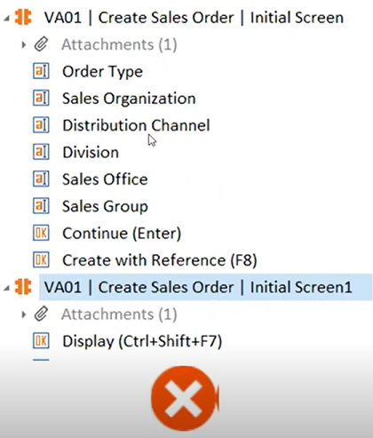

**Benefits:**

- Duplicate Modules lead to additional maintenance effort. By only having every element once, you can reduce that effort significantly.

### Rename Modules appropriately after creation

When you create a Module with Tbox XScan, the Module name is created automatically using the window caption. This will not always reflect the true purpose of the Module. You must rename the module. When naming the Module, include the application and section name. This simplifies identifying the Module when using “fuzzy” search.

Use as: `*\<T-code\>* | *\<Screen-name\>* | *\<Tab-name\>* | *\<Screen description\>*`

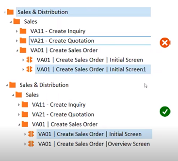

**Benefits:**

- giving Modules a proper name makes it easier to find them.
- it is also done for the sake of maintaining clarity and identification, particularly for all other testers and experts working on the project.

### Add more than one ModuleAttribute to Modules
  
When you have Modules that contain all the ModuleAttributes of a section of the screen, you can create more readable and maintainable test cases. If you create Modules with only one ModuleAttribute, many Modules will be needed to steer your SUT. This increases the number of TestSteps and make test cases difficult to read.

**Benefits:**

- more ModuleAttributes within one Module reduces the number of Modules and TestSteps
- makes your portfolio and your TestCases easily readable and maintainable

### Avoid using Index for ModuleAttribute identifcation

Avoid Identifying a control by Index as minor changes in the SUT can lead to failed test cases. Instead, controls should be identified by properties or anchors. Use index only if you cannot choose other identification criteria to uniquely identify the control.

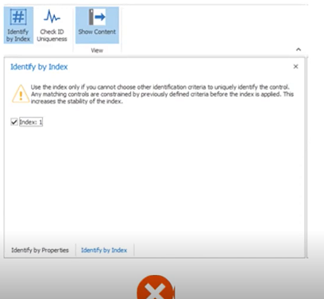

### Avoid using image-based identification

Image-based recognition should only be used as a last resource, as image-based automation is dependent on screen resolution, consistent appearance and non-variability of the control contents. Use it when there is no other option to steer the controls, mainly useful to steer the Maps.

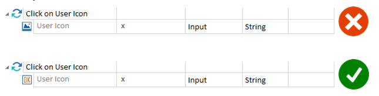

**Benefits:**

- test cases are more stable
- easier to maintain
- more readable 
- can be used for distributed execution.

### Combine Module Attributes in control groups, if possible

Modules should be logically named for the screen each represents, or the control group on a screen if the control group appears in more than one screen instance.

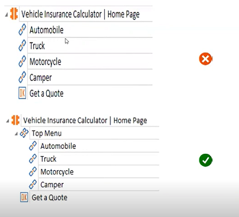

**Benefits:**

- reduces errors
- increases readability

### Name ModuleAttributes appropriately

Module Attributes should be named after the definition of the field on the screen. The Module Attribute’s name should be in a readable form and not just a technical definition.

**Benefits:**

- Business-related names will help to identify the correct control in the Test Step
- Makes them easy to understand for business users.

### Make use of cardinality

When using a ModuleAttribute more than once in a TestStep, consider using the cardinality parameter. Cardinality allows you to use the same ModuleAttribute multiple times within a TestStep without having to copy it. Default cardinality is set to “0-1”. For multiple use, it must be set to “0-n”.

**Benefits:**

Using cardinality increases readability and simplifies maintenance.

### Use standard modules wherever required

Use standard modules wherever required. Standard modules will get imported by default while creating the workspace and this will avoid creating extra modules. We can use the standard modules like *openurl* to access the application and to close the application use TBox window operation module etc. which are available in the standard modules.

**Benefits:**

Using standard modules will avoid creating extra modules, making maintenance easier.

### Use parameters

Both XModules and XModuleAttributes are defined by their default properties. In addition, they are also defined by using specific parameters. These params are relevant since they have an impact on the system's interaction with controls. 
These configurations are created in the Properties tab. In Tosca we have Configuration, Identification, Steering and Transition parameters. The parameters used most are ScrollingBehaviour, WaitBefore, WaitAfter, ExplicitName, AvoidSnapper.

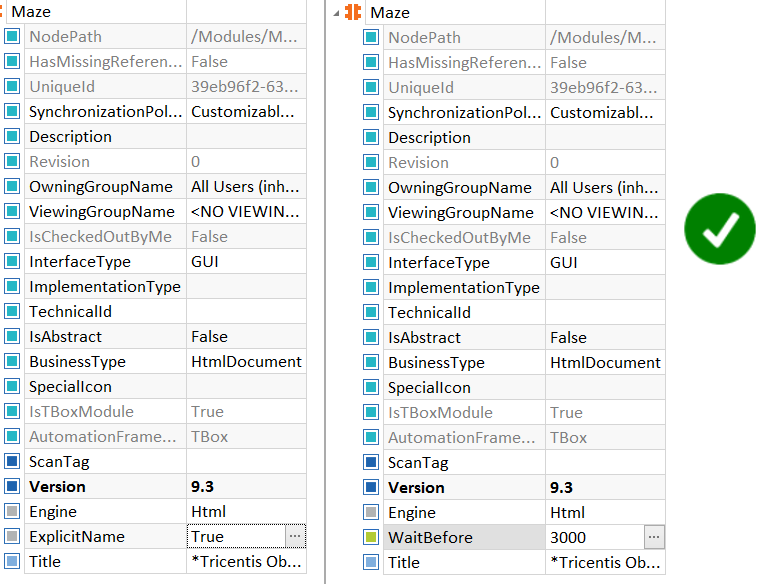

**Benefits:**

These parameters define which TBox components are used for steering controls and to specify the behaviour of a control.

## Structuring Test Cases

### Test Case Folder Structure

Within a Test case, use folders to separate logical sections. We recommend the following structure: **Precondition** for starting the SUT and preparing test data; **Process** for the actual test, and **Postcondition** to perform clean-ups and close the SUT. Within those folders, a folder structure should be used to group test steps.

Keep the specific process test steps in a folder ex: Login process; we enter the credentials and press the login button, then verify the user logged in. Keep this in a folder so that it will be easy to identify.

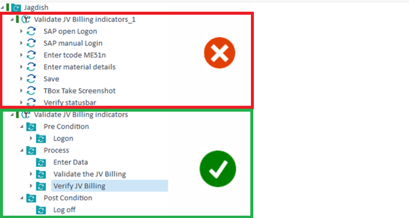

**Benefits:**

When using this folder structure, the content is separated and easily readable, even when expanded. Also, it is easier to focus on the separate parts of the process.

### Test Case Verification Points

Every test case should have at least one verification point. This ensures that the functions of your SUT are verified to work, otherwise your test case would not have a defined outcome.

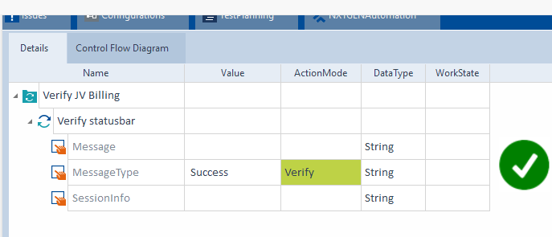

**Benefits:**

With a "Verify" value, you can ensure that the system under test is behaving as expected. Every test case needs a verification point, but Business test cases which may be used to perform actions that are needed for a subsequent test case might not need one. Make sure to therefore add verification points to test cases only where required.
 
**Note**: By adding verification points, Tosca will capture the Screenshots of the verification if we have enabled the DOKU Snapper in settings.

### Test Case Workstates

Setting Workstates on test cases provide a good overview on the test case status. They help with the overview of the Requirements section. Each Workstate translates to a specific percentage of completion to the work of that section (i.e. PLANNED gives 20%, INWORK gives 50% and COMPLETED means 100%). This provides a good overview of the status of test cases, as well as which Requirements have been covered.

**Benefits:**

- Workstates make it easier to see the status of a test case in the test cases section and in the Requirements section, and makes it easy to check the state of the test case.
- By renaming test steps and Modules even a person not involved in the test case creation will be able to more easily understand the process being validated.

### Synchronization

During execution, Tosca and the AUT often require synchronization. Static waits using the Tbox Wait Module should be avoided. Instead, use the ActionMode “WaitOn”. WaitOn ensures that test execution is not prolonged unnecessarily, which impacts execution performance.

**Note**: By default, the synchronization for WaitOn will be 20000ms. This can be modified if needed. It’s often best to increase the time so that the test case is not erroneously failed.

**Note**: We can also use the Steering parameters of wait: 1. WaitBefore 2. WaitAfter.  This also help steer the application, even though it is static wait.

### Avoid keyboard and mouse emulsion

The `{SENDKEYS}` and `{CLICK}` commands should be avoided whenever possible. These commands emulate keyboard or mouse movements and are slow, less stable and can have a negative impact on unattended execution.  Instead, use “x” to execute the click event directly on the control or use direct steering in text boxes.

**Benefits:**

Avoiding keyboard and mouse emulation increases speed and stability, and facilitates remote execution.  Direct steering can be also used if a computer is locked.

### Test case names

Each test case should have a unique name within a project or component folder. Use the same name in the test design sheet to avoid confusion.

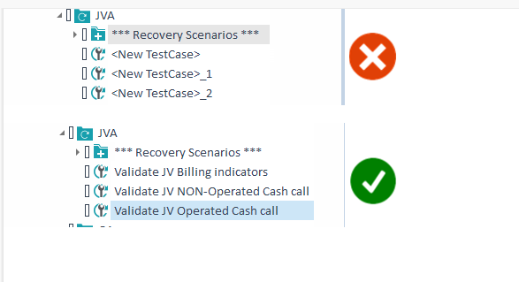

**Benefits:**

Unique test case names increase readability, make searches easier and make reports more readable.

### Make use of recovery scenarios

Recovery scenarios help you with unexpected occurrences errors/issues while running test cases. Sometimes unexpected screens/popups etc. can make a test case fail. Creating Recovery Scenarios will help to deal with unexpected occurrences and then restart either the Test Case, TestStep or the TestStepValue after recovering to a SUT known state.

**Note:** you must previously anticipate an unexpected occurrence such as a screen/popup because Tosca must be instructed on how to deal with the situation should it arise. This is when Recovery Scenarios come into play. 

**Note:** Recovery scenarios only work when executing test cases in an Execution List.

**Benefit:**

Recovery scenarios ensure that your test cases do not encounter an error which may stop your entire Test Set from running due to unexpected issues like popups, cookie notifications, or other unexpected conditions.

### Implement clean-up scenarios

Clean-up scenarios will help you to reset your SUT to a known state when a test case fails. They ensure that you can run subsequent test cases. Without the, it can be problematic to run multiple test cases in a row.  Clean-up scenarios ensure that you can get back to the base state for the next test case by ‘cleaning up’ after an unexpected condition. 

**Note:** Clean-up scenarios only work when executing test cases in an Execution List.

**Benefits:**

Clean-up scenarios help you to make sure that when a test case fails you can start the next one without any manual intervention. This is especially necessary for unattended execution wherein we need to ensure that a failure of 1 test case does not affect the remaining test cases.

### Recovery Scenario Retry Level

Make sure that your Recovery scenarios restart on the correct RetryLevel. By default, it will be on the test case level which means that after the Recovery scenario the entire test case will restart. This is not always what you want or is not even always possible. Setting the correct RetryLevel will ensure that the test case does not run into other issues.

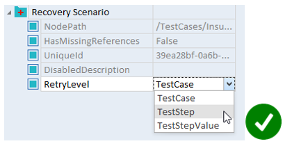

**Benefits:**

If a test case restarts on the correct level, it is possible to run your test cases correctly even when faced with unexpected issues.

### Create Test Step Blocks Based on Reusability

Make use of Reusable TestStepBlocks when creating new test cases. 

**Note:** Reusable TestStepBlocks should only be created if they are intended to be reused, as they would otherwise clutter the repository.

**Benefits:**

Reusable TestStepBlocks help to save time and effort as created reusable blocks can be easily re-used in the entire project.

### Test Configuration Parameters

Use Test Configuration Parameters to set overall variables, such as setting a web browser URL. This is done so that everybody working on the project uses the same variables when testing the same test cases. Values that change between test cases should be part of the TestSheet.

**Note:** The syntax to use the Test configuration parameters is `{CP[test configuration parameter name]}`

**Benefits:**

Using Test Configuration Parameters ensures that values can be managed from a centralized point, rather than changing them in each step, creating higher maintenance. This method ensures that everyone working on the project is using the same variables for test scripts.

### Execution Lists -Logs and scratch Book

Every test case that is ready to execute needs to be in an Execution List. Execution Lists will generate logs during execution of test cases and makes it possible to run multiple test cases in a row without manual intervention. 

During test case development/creation, test cases can be debugged in Scratchbook. Once completed, drag the into an Execution List for execution.

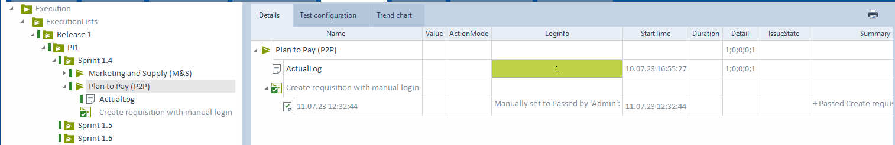

**Benefits:**

When test cases are run in a Execution List, the history of prior runs is available, allowing for recovery and clean-up scenarios to be kicked in.

## Multi-User Workspaces

### Separate Login Credentials for Each User

When you work together in a repository it is wise to create login credentials for everyone separately, so you do not get access conflicts even if there are enough licenses. It will also help you to see who has something checked out or who adjusted something last.  

**Benefits:**

Separate login credentials in a common repository reduce access conflicts and you can ask someone to check something in when you need it. Also, you can see who updated an artifact.

###	Separate regular users and administrators in a common repository

By separating the kind of users, you can make sure that the right people are able to set access rights, add users, disable users and create or delete user groups. With these rights you can decide who is able to see what and/or can adjust something. It is important to not only have one administrator but also to not make everyone an administrator.

**Benefits:**

Separating users will help you to set correct rights for users and make sure that it is not possible for everyone to do this.

###	Use a buffer only within one test case

Setting, adjusting and using a buffer within one Test Case ensures that data is not used from different Test Cases. Buffers are set on the device where you run the Test Case on. Therefore, using a buffer that was set on a previous Test Case might create potential problems as this is not set on the machine executing your current Test Case. There might also be a problem with old data, if the Test Case has not been run in a while. By setting, adjusting and using the buffer only in one Test Case you make sure that the data is always up to date and the buffer is always created and available.

Tbox Delete Buffer can be used to delete a buffer and the value associated with the buffer.

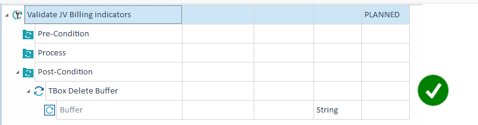

**Benefits:**

Using a buffer only within one Test Case ensures that you are using data that is up to date and not from another Test Case. 

### Store shared settings in the project settings

Using project settings instead of workspace settings ensures that everyone (including Agents) has the same settings. This eliminates problems that could stem from different synchronization times, different extension locations, or other settings. These settings are saved in the common repository, so everybody is up to date as soon as they press the update all button.

**Benefits:**

Storing shared settings in the project settings makes sure that everyone is using the same settings, thus eliminating different sources of errors.

## Useful Links

- [Keyboard Shortcuts](https://documentation.tricentis.com/tosca/1600/en/content/tosca_commander/appendix.htm)