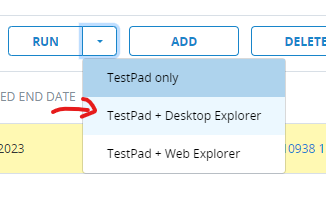
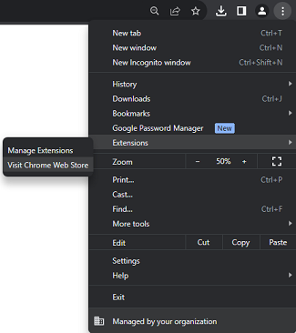
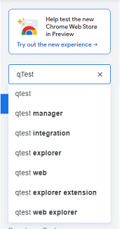

# Getting-started

**[Go to qTest   :fontawesome-solid-paper-plane:](https://equinor.qtestnet.com){ .md-button }**

<iframe src="https://statoilsrm.sharepoint.com/sites/IntegratedNextGenERPTeam/_layouts/15/embed.aspx?UniqueId=6cc64896-bc64-4ec3-8d4a-4c034aab61ff&embed=%7B%22ust%22%3Atrue%2C%22hv%22%3A%22CopyEmbedCode%22%7D&referrer=StreamWebApp&referrerScenario=EmbedDialog.Create" width="640" height="360" frameborder="0" scrolling="no" allowfullscreen title="Qtest intro video.mp4"></iframe>

**[Continue to the training videos](./qtest-training-session.md){ .md-button }**

## Getting access to qTest

  
1.  Go to Equinor Access IT website (https://accessit.equinor.com) and search for qTest.
2.  Select appropriate role and add it to cart (to develop test cases chose Test Developer).
3.  As soon as your access is granted you will receive e-mail confirmation. You can access qTest via SSO long (credentials are not required).
4.  Log in to qTest through https://equinor.qtestnet.com

!!! note 
    When access is approved and you have logged in for the first time, reach out to your QA SME if you need to edit test cases. 

    The QA SME will provide you with the correct role in qTest.

    External hire need to log into AccesIT via Citrix: https://connectit.equinor.com

## Installation qTest Explorer
### Equinor environment

1. Open Equinor Applications.
2. Install Chrome and qTestExplorer.

### Non-Equinor Alternative

1.  Go to https://equinor.qtestnet.com/p/120469/portal/project#tab=resource and follow the installation procedure.
2.  Download the latest version of Desktop Explorer 7.2.8.6 and save it on your desktop.
3.  Run the qTestExplorer.exe file to start the installation process.

!!! tip
    First time login to qTest Explorer: Log in to qTest and execute a test run (TestPad + Desktop Explorer).
    

## Installing qTest plugins

1.  Go to your Chrome browser to install the qTest Integration Browser extention so that you can open desktop explorer from your test anf to link Jira through your tests.
2.  In your Chrome browser click on the three dots in your right corner - Extensions - Visit Chrome Web Store.

3.  In the Chrome Web Store serach for qTest and add all three extensions to Chrome.

 

4.  You should now be able to see the extensions in your browser.

## Additional material:

**[Tricentis documentation](https://support-hub.tricentis.com/open){ .md-button }**

<iframe src="https://statoilsrm.sharepoint.com/sites/IntegratedNextGenERPTeam/_layouts/15/Doc.aspx?sourcedoc={c0b205e8-0e90-4801-a7c2-2fd181e02176}&amp;action=embedview&amp;wdAr=1.7777777777777777" width="952px" height="564px" frameborder="0">Dette er et innebygd <a target="_blank" href="https://office.com">Microsoft Office</a>-dokument. Leveres av <a target="_blank" href="https://office.com/webapps">Office</a>.</iframe>

