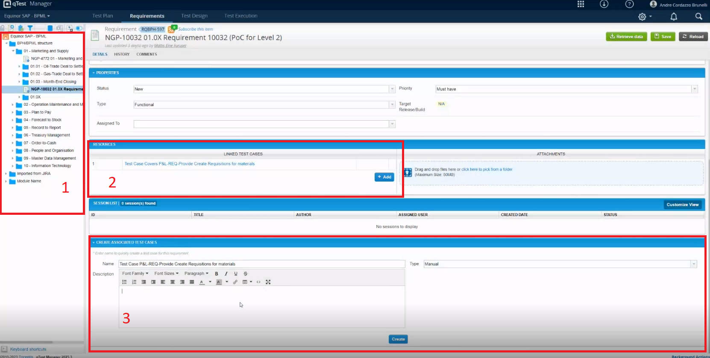
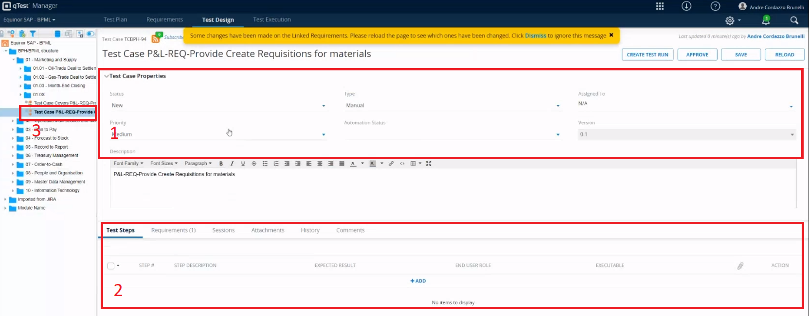
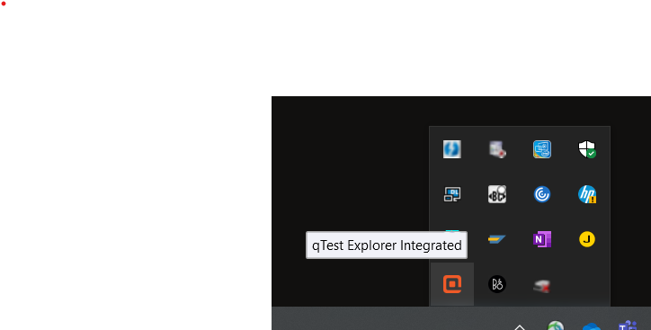
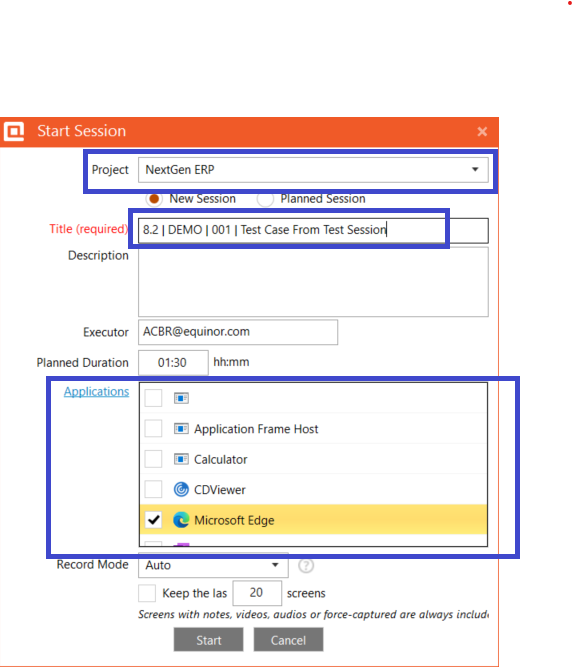
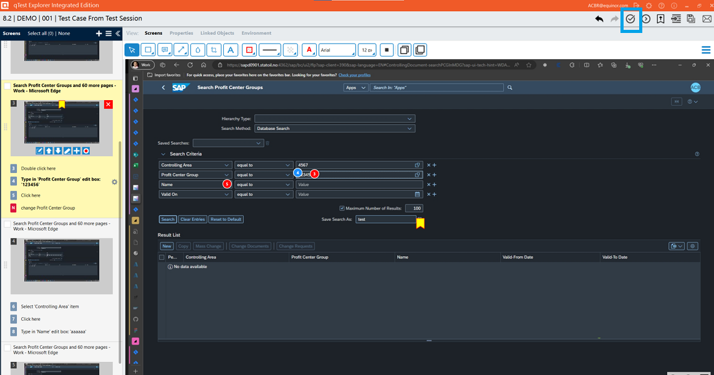
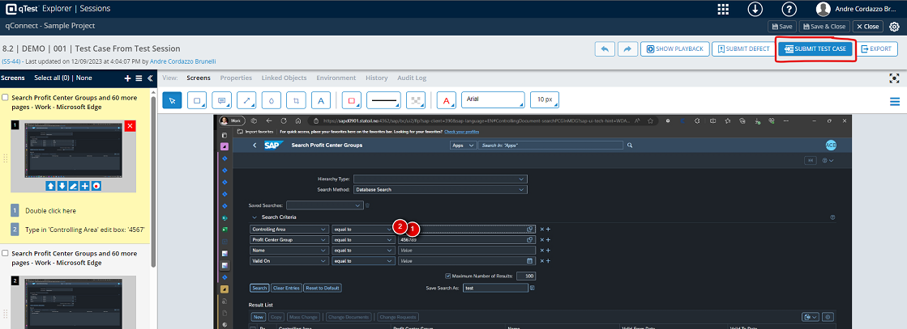
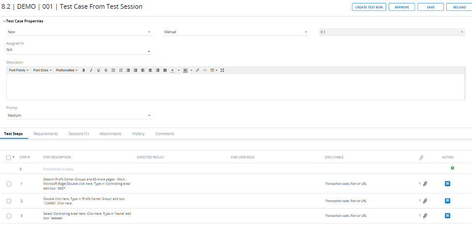
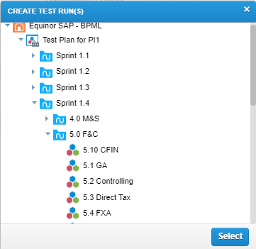
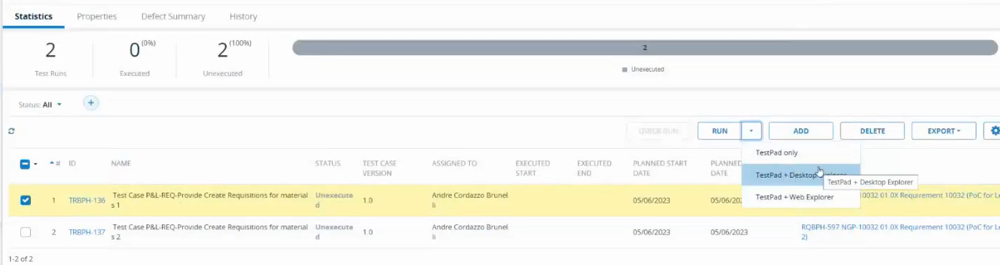
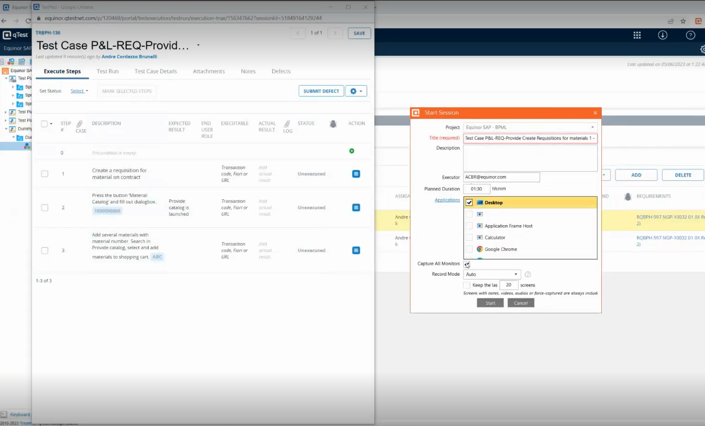

# qTest Guideline

## Creating a Jira User Story In Accordance to qTest

When creating an User Story (US) in Jira some fields must be configured in order to prepare it to be used later in qTest. 

- **Project:** NextGen (NGE)
- **Issue Type:** Story
- **Story Type:** only Configuration and Development types should be considered for testing as a general rule. As Spike US's deliver knowledge and Enabler US's deliver value to a user or the outcome of a sprint they are not expected to result in verifiable software changes.
- **Linked Issues:** choose `Implements` and find the requirement you are testing against.
- **Charm ID:** find the 10-digits Charm ID you are testing against on Solution Manager.
- **Functional Test Required:** **`Yes`**. Be selective on which user stories are being marked with `Yes`. The following should be avoided:
  - Enabler US's;
  - User Stories that will not have test case developed in the current sprint. Create another US linked to the current one where the test cases will be developed;
  - User Stories with only unit testing;

You can see the chosen details on the new User Story. Notice also that there are two subtasks, one for creating and another for executing test cases related to this US. 

  

## Creating a Test Case

You find qTest [here](https://equinor.qtestnet.com/portal/loginform?redirect=https%3A%2F%2Fequinor.qtestnet.com%2Fp%2F120469%2Fportal%2Fproject%23tab%3Dtestexecution%26object%3D2%26id%3D6233891). Use the Equinor ID to perform login.

At the left side you can select the project to work on. Please choose "Equinor SAP - BPML".

Once logged in you have four main tabs on top of the portal:

- **Test Plan**: Not relevant for test developers. Reserved for PO's and QA SME's
- **Requirements**: where we create new test cases based on requirements
- **Test Design**: add properties and details to test cases
- **Test Execution**: List of created test runs

We then open `Requirements` tab to start a new test case. In this page it is worth noticing:
1. the BPML structure with the requirements added to Jira
2. test cases already linked to the selected requirement
3. area to create a new test case

Once the new test case is created it is added to the test cases area. 

By clicking on the new test case you are transferred to the `Test Design` tab. This is where we write a test case. It has two main parts:

1. **Properties**: the following may be configured.
   1. Status: starts as `New`.
   2. Type: manual, automation, security.
   3. Owner (component/team): the team responsible for this test case.
   4. Assigned To: test developer (or Product Owner when under approval).
   5. Automation Priority: low/medium/high.
   6. Automation Status: not started/in progress/completed.
   7. Version: automatically set up and updated. Round numbers indicate versions available for production.
2. **Test Steps**: a test case must contain steps where the tester performs actions against the SUT. For each step:
   1. Step #: automatically generated
   2. Step Description: description of the action conducted by the tester. Here the test developer should use parameters from [qTest Manager | Parameters](https://parameter-6.qtestnet.com/#/parameters) instead of writing static values to parameters
   3. Expected result: short description of the expected behavior of the SUT
   4. End-user role: SAP role 
   5. Executable: script executed during step
   6. Attachment (paper clip icon)
   7. Action: control actions to be performed in the step such as moving it up or down in the test case
3. The test case under the BPML structure. Notice that the icon has only orange details. This means that it's last `Status` is not approved.

Other tabs besides Test Steps include Requirements, Sessions, Attachments, History and Comments.

When working on a test case, a test case developer should:
- set `Assigned To` to himself;
- set `Status` to `in progress`;
- choose `Type`, `Owner`, `Automation Priority` and `Automation Status` (the two last ones only for automation);
- add a description of the test case;
- add test steps. Remember to use add parameters by using `@<parameter name>`. Once you type `@` and any letter you should see the available parameters.
- once the test case is ready to be reviewed:
  - change `Status` to `Ready for Approval`
  - change `Assigned to` for the quality SME responsible for your team
  - click `Save`

The `Version` is automatically updated with one number after the decimal up. IF the quality SME approves the test case the `Version` is rounded up to the next full number (e.g. if `Version` is 0.3 and the quality SME approves it, `Version` becomes 1.0). Also the icon for the test case now has one green check, indicating that its last status is approved.

## Creating a Test Case from a Session

This alternative to create a test case allows the test case developer to run a session on qTestExplorer Integrated, record the usage of the tool to be tested just like in the expected test case, and then generate a test case from it, with test steps and annexed screenshots.

To start a new session, find the icon for qTest Explorer in your applications tray and click on it.

- if you must install qTest Explorer yet, refer to the [installation of qTest Explorer](https://sap.equinor.com/qa/manual/getting-started/#installation-qtest-explorer-applies-to-those-without-an-equinor-laptop).

**NOTE**: if your qTest Explorer logo is shown in gray color it means it has not logged in yet. The easiest way to log in is to find a test case in qTest under Test Execution and run with Desktop Explorer. Once the Desktop Explorer opens you may cancel the run and try with the button on the applications tray again.

Once qTest Explorer pane opens, update the following fields:

 - Project: use "NextGen ERP".
 - Title: add a title using the naming convention in [qTest Best Practices](https://sap.equinor.com/qa/manual/qtest-best-practices/).
 - Applications: choose the applications you intend to test.

Click on Start. The current pane closes and a smaller one with the execution time is displayed. Remember that the control buttons appear only when you hover the mouse over the timer.

For each step in your execution ideally it should be added a note in order to be easier to understand the step later on. This is to avoid having steps where the description only says unclear descriptions, such as "click here".

Use the applications as you need for your scenario. Once you are done, click on the Stop button in the pane. Another pane opens asking you to either accept the execution or edit it. Choose Edit, qTest then shows a list with the recorded actions. You can eventually add better descriptions and remove unnecessary steps.

 Once you are finished, click on the button on top right corner to save the session.

The browser then opens with the same list of steps. Click on "Submit Test Case".

You are presented a preview of the test case. You can either group all actions of a screen as a single step or have them as separate steps. This is optional. Finally, click on Submit.

A new test case is created under no specific BPML in the hierarchy. 

After the test case is created, remember to do the following yet:

 - Drag it to the correct BPML. 
 - Go under the Requirements tab and add the correct requirement.
 - Add Expected Result, End User Role and Executable for each step.
 - change Status and Assigned To accordingly.
 - if you are running the session already on the Quality environment and you need to run the test case only once (you don't have multiple variations of the test case with different parameter values or datasets) you may mark the subtest "Execute Test Cases" to Done.

## Creating Runs

You may create a new test run from the Test Design view by cliding on `Create Test Run`. A pop-up opens and you should then choose the test suite where the test run will be created. If you cannot find a suitable test suite for the test case click on `Test Execution`, find the test cycle where you expect the test suite to be, right-click on it and choose `Create Test Suite`.

After choosing the test suite a new pop-up is displayed, where you can create several test runs for this test case. The following fields are relevant:
- `Create Run Data`: 
  - `Manually`: the test developer adds values from drop-down menus for each configured parameter
  - `Randomize Data`: qTest will pick available parameter values randomly
  - `From Dataset`: uses a pre-added dataset as source
- Assign parameter values to each Test Run: add as many test runs as necessary for each test case and vary the parameter values to create coverage for your tests

Once created the new test runs will be visible under Test Execution.

## Executing Test Runs

To execute a test run click on `Run -> Testpad + Desktop Explorer`.

Two pop-up windows appear. The first one contains the test steps from the chosen test case. The tester can use it to update the progress of a test run, and mark test runs as success or failure. 

The second pop-up is the `start session` screen for qTest Desktop Explorer. The user can select which applications are being recorded during the test execution (use `desktop` if you are taking action on not only SAP but Fiori or another application during the test execution) and the record mode (with `Auto` qTest takes screenshots automatically; `Manual` for cases where the tester will decide when to take screenshots; `Time Interval` and qTest takes screenshots at predefined intervals). 

In `Start Session` after clicking on `Start` the test run starts and another pane is shown. This pane contains a timer for the running test and some buttons for actions:

- stop test
- force screenshot: can be used even in tests marked with record mode `Auto`
- media: record audio or videos during a test run
- notes: useful to take notes during a test execution in case some important information should be available at a specific test case execution
- show/switch time type: not relevant
- pause test: if during a test execution the tester must use the computer for something else e.g. read emails he can pause the test, do other actions and after he is done resume execution

Testers should update the status of each test step as they execute a test run.

After the tester clicks on `stop test` he is prompted whether to complete session or edit session. We recommend editing the session right after running it so that the tester goes through all recorded actions and screenshots and deletes the ones he deems unnecessary. 

Once done the tester should click on `Complete Session` (top-right corner). In the test steps pane the tester will set status for the test run and save. This in time will update the status of the test run under `Test Execution`. 

## Reporting Defects

In the case of a test case run that results in a defect being found the tester must report it. The easiest way to do it is from the test steps pane, where he clicks on the defect button on the step where he noticed it.

He should select the choices `include all test step details` and `include test execution details in defect's comments`, then click on `new` and `add`. The tester is then redirected to Jira where he must create a new `Defect` issue.

Notice in the `Description` field that the test steps have been added here. The tester should add comments at this point under the step where the defect has been discovered to describe what was found. It is recommended to use "expected" and "result" format to describe the finding.

The following fields must be filled up in the Jira defect:

- **Linked issues**: `blocks` and the requirement the test case is linked to
- **Defect Category (mandatory)**

After saving the defect, the requirement it has been linked to will have a reference to the defect.

The two subtasks which had been created when creating the User Story can be updated. The one for creating a test case can be set to `Done`. The one for executing the test case will depend on the result of the test case execution. Test cases with pending defects should not be marked as `Done`, but can rather be changed to `Realize`, which means that it is in progress.