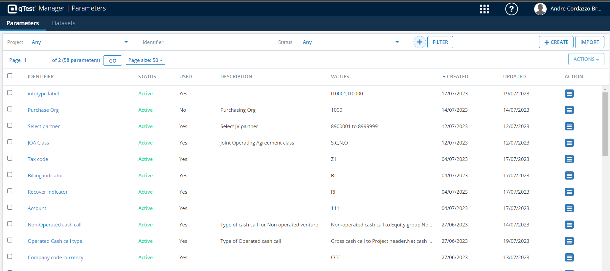
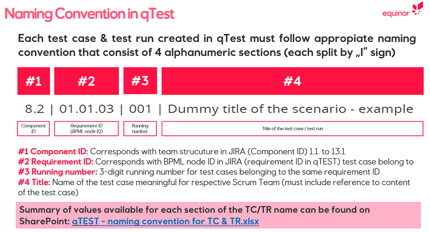

# qTest Best Practices

## qTest Parameters

To open qTest [qTest Manager | Parameters](https://parameter-6.qtestnet.com/#/parameters) you may also click on a parameter being used in a test case. You are redirected to the Parameters page.

Each parameter may have several values. Test Cases should not have static parameters written into them, but rather refer to qTest Parameters as it greatly reduces maintenance effort. 

## Test Case Naming Convention

Please use the following naming convention for test cases:

